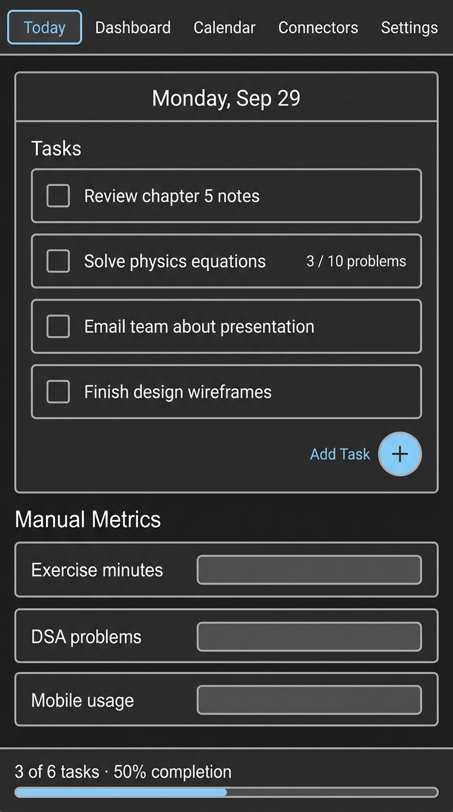
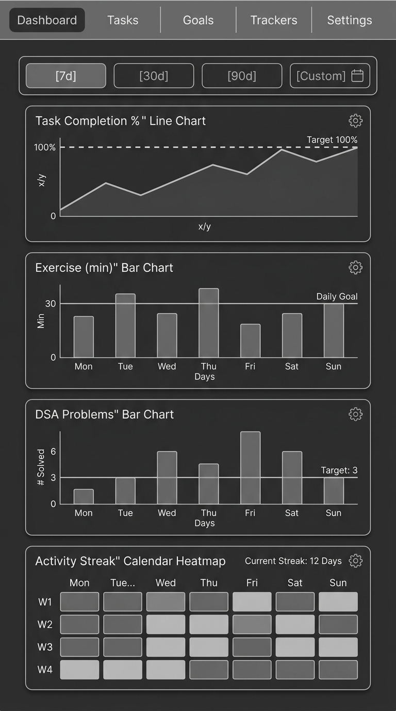
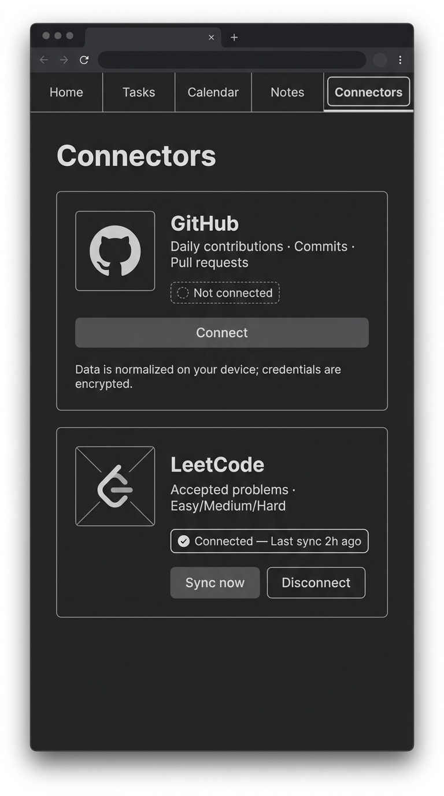

# Personal Analytics — Wireframes (V1)

_Last updated: 2026-09-29_  
_Format: generated images + annotated layout notes_

Three key screens are wired: **Today**, **Dashboard**, and **Connectors**. Calendar and Settings are straightforward and described in notes only.

---

## Today

### Layout notes

| Zone | Detail |
|------|--------|
| **Nav bar** | 5 tabs: Today (active), Dashboard, Calendar, Connectors, Settings. Sticky top. |
| **Date header** | `Monday, Sep 29` in user-local timezone (`YYYY-MM-DD` key internally). |
| **Tasks section** | Each row: checkbox · title · optional `completedValue / targetValue unit` badge. Tap row to expand edit. Reorder via drag handle. |
| **Quantitative task row** | Separate "target progress" inline — e.g. `3 / 10 problems`. Checking the checkbox marks task done, not "target hit". |
| **Add task FAB** | Bottom-right of task list. Opens inline form: title, optional target value + unit. |
| **Manual Metrics section** | Three rows: Exercise (min), DSA problems, Mobile usage (min). Each is a number input field. Saved on blur/enter. |
| **Progress bar footer** | Fixed bottom strip: `N of M tasks · X% completion`. Completion = done-task-count ÷ planned-task-count. Target progress shown separately on expand. |

---

## Dashboard

### Layout notes

| Zone | Detail |
|------|--------|
| **Range selector** | Toggle: `7d` / `30d` / `90d` / `Custom`. Default 7d. Custom opens date-picker. |
| **Task Completion % (line)** | Y-axis: 0–100 %; dashed line at 100 %. X-axis: dates. Tooltip shows exact %. |
| **Exercise (bar)** | Y-axis: minutes; daily goal line if set. Missing day = zero bar (not gap). |
| **DSA Problems (bar)** | Y-axis: count; target line if set. Colour: consistent with task completion metric. |
| **Activity Streak (heatmap)** | Custom SVG calendar grid. Shade = any task completed that day. Current streak badge top-right. |
| **Widget config icon** | Top-right of each card; opens drawer: chart type, goal line, rolling average. Presentation only. |
| **Empty state** | Each widget shows "No data yet — log your first day on Today" if date range has no rows. |
| **Daily detail panel** | Tap a bar/point → right-drawer showing that day's planned vs completed vs connector records. |

---

## Connectors

### Layout notes

| Zone | Detail |
|------|--------|
| **GitHub card** | Status badge: `Not connected` / `Connected — Last sync Xh ago` / `Error — action needed`. Buttons: `Connect` → PAT entry flow → preview → save. Once connected: `Sync now` + `Disconnect`. Privacy note always visible. |
| **GitHub connect flow** | Step 1: explain what is read (contributions, commits, PRs). Step 2: PAT input (masked). Step 3: 7-day preview. Step 4: confirm → persist. |
| **LeetCode card** | Same layout. Auth: username only (public data). Status + `Sync now` + `Disconnect`. |
| **Error state** | Red badge, one-line error message, actionable CTA (e.g. "Re-enter token"). |
| **Disconnect** | Confirm dialog: wipe credentials + ask policy for historical imports (keep / delete). |
| **Privacy copy** | "Data is normalized on your device; credentials are stored only in your local encrypted vault." |

---

## Calendar (notes only)

- Monthly grid; each day cell: shade = task completion %; dot = manual metrics logged.
- Tap day → navigates to that day's Today/log view (same component, historical date).
- Streak counter shown above grid.
- No edit from Calendar — editing redirects to Today with that date.

---

## Settings (notes only)

| Section | Controls |
|---------|----------|
| Preferences | Timezone selector, first-day-of-week |
| Privacy | Static copy: "Local-first. No account. No server personal data." |
| Export | Readable JSON download · CSV download |
| Backup | Encrypted backup export (passphrase entry) · Import (file picker + passphrase + schema validation warning) |
| Danger zone | Delete all local data (double-confirm) |
